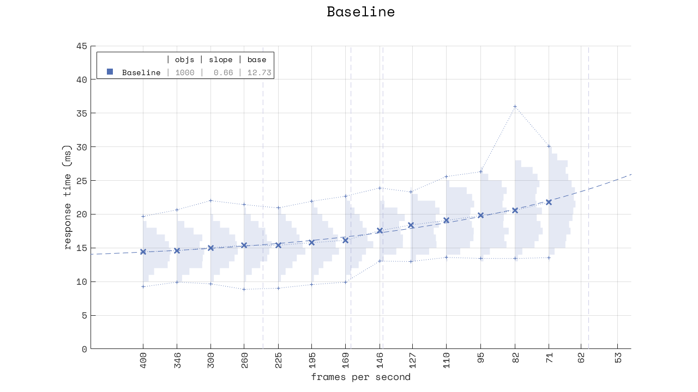
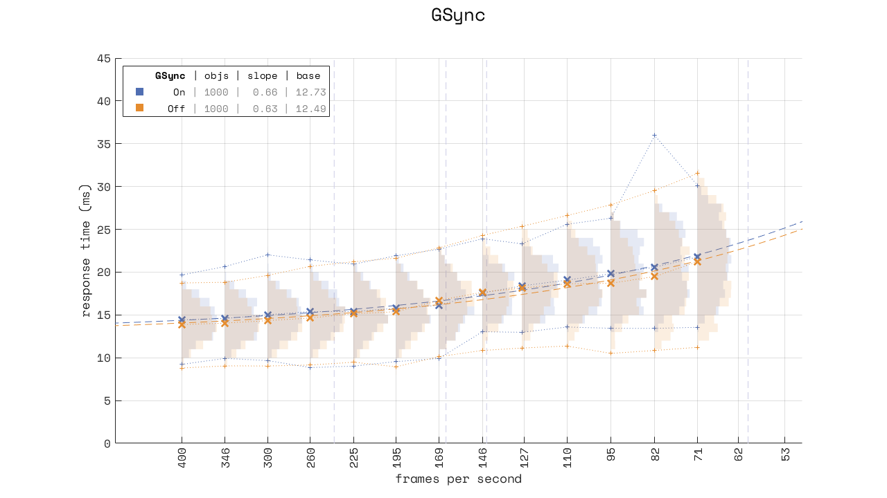
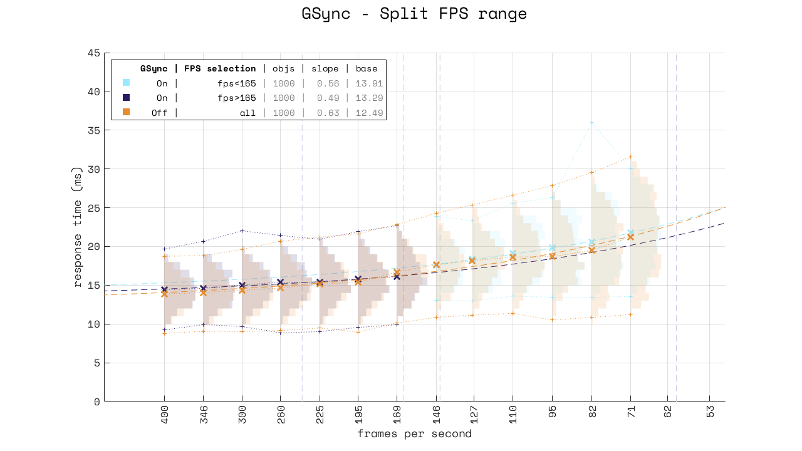
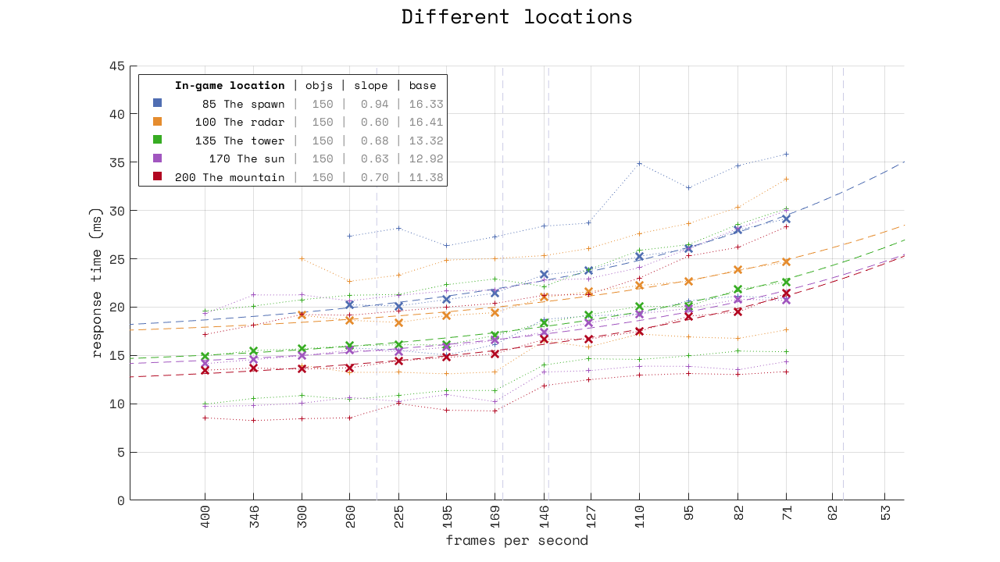
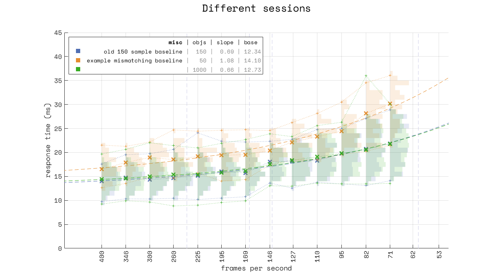
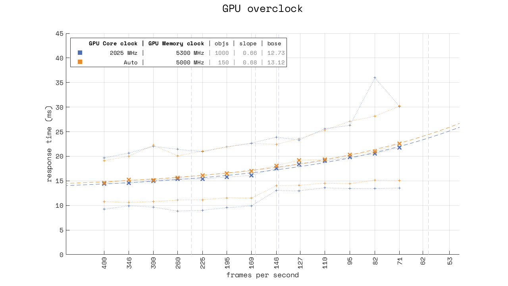
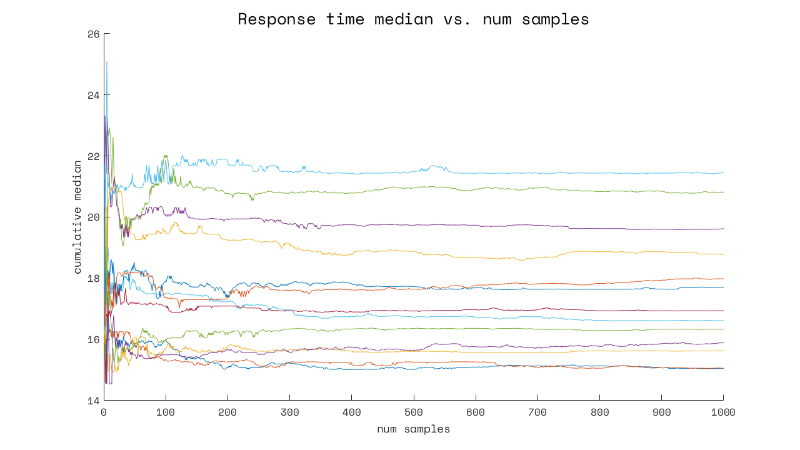

Response time has variation
===========================

The basic plot
--------------

This figure shows the response time ("input lag") in Overwatch. 

 - The sideways histograms: The distribution of the samples at each framerate
 - **`x`** markers: The median for the distributions at each framerate
 - `+` markers: The minimum and maximums
 - `--` dashed line: The best fit line for the medians
 
Note that the plot is logarithmic on the x-axis. Each larger framerate is 13.5% higher than its neighbor. This representation more clearly shows the diminishing returns from going higher in framerate than a linear one would. Just note that the dashed line is in fact straight, it's just the "paper" that is curved.

 - `objs`: The number of samples for each framerate tested.  
   *In this case 1000, for a total of 12000 samples in this image.*
 - `slope`: The gradient of the best fit line.  
   *In this case 0.66, which means a 0.66 ms improvement (reduction) in response time for 1 ms decrease in frame interval.* 
 - `base`: The theoretical median response time at infinite frames per second.  
   *This is mostly included for completeness, though it is sometimes useful when comparing different scenarios.*
   
FPS examples of 1 ms reduction in frame interval: `60->63.8`, `144->168`, `240->316`, `360->563`. This is another example of diminishing returns, though less intuitive than seeing it graphically.

### Observations

**Distribution**: The response time varies *a lot*. Even at high framerates, response time varies from 10 to 20 ms. **There is no such thing as "constant input lag".**

**Lag spike**: There is a spike in the maximums at 82 fps. This is the classic "lag spike", where Windows decides that other things than the game are more important, and delays execution of *something* related to the game.

**Discontinuity**: There is a break from 169 to 146. This is because GSync is enabled with a 165 Hz monitor.

**Symmetry**: The response time distribution is not symmetric, but it is close. And there is also a possibility of unbounded maximums (and the impossibility of unbounded minimums - you can never go faster than 0 ms). Because of this, the right thing to do is to use the *median*, and not the mean (though they are frequently very close).

### A comparison plot with GSync

Here is a comparison plot for GSync:

Because of the discontinuity around 165 fps, the blue trend line should really be split in two segments. 

From this we can conclude:

 - GSync has a small impact on response time.
 - The impact is not correlated with framerate (they share the same slope), so statements like "adds one frame of input lag" are wrong.
 - The impact on the median is more or less constant.
 - The impact on the minimums is about 2 ms when below refresh rate.
 - The distribution of response time "flattens" (less "normal" and more "uniform") when below refresh rate.

Settings matter
---------------

Not only is there a lot of variation in response time *in general*, there are also constant-offset effects, which are not-so-constant when in normal gameplay situations.

The first is the impact of the testing location:

The number refers to the maximum (uncapped) framerate obtained at that location when using 200% render scale. Lower max framerate means that there is more work to do to render that frame. More work means that it takes longer to do the work, and therefore the work will be completed later, and so response time drops. This is the case regardless of how long the breaks are between frames.

At 260 fps, we see that response time can vary from 8 to 27 ms, a ~3.3x factor. Again, **there is no such thing as "constant input lag".**

The second is the impact of random unknowns:

These three runs were taken in different sessions. The goal was to increase the sample count from 150 to 1000 for a more accurate baseline, but for whatever reason a 50-sample test run gave results that were 2-3 ms higher than expected. Rebooting fixed the issue - we'll never know what happened...

The third is hardware settings, with this example being a GPU overclock:

Thermal throttling or other automatic frequency changes will have an impact on response time. Though the size of the effect might not be large, it is large enough to show up in measurements, and therefore large enough to invalidate results.

Sample count matters
--------------------

This figure shows the median of `[0..n]` samples, where each line is for a different framerate.

The question is "how many samples do we need for an accurate result"? Things start to "clean up" around 150 samples, though only get really good around 500. But the answer is definitely not anything below 100.

Tips for people doing response time measurements
------------------------------------------------

 - You need large sample counts, 150 is a good compromise between accuracy and time taken.
 - You need to test multiple frame rates.
 - You should use the median, and not the mean.
 - You need to test at the same in-game location every time.
 - You must take a new baseline measurement for each testing session.
 - You must be wary of your game and system settings.  
   (And re-measuring the baseline at the start and end of a session is a good way to be sure)
 - You need to make sure your system is properly configured and optimized.
 - You should not report single numbers, or numbers with higher precision than than your equipment can measure.
 
If you are using a high-speed camera and counting frames, get with the programme and buy a microcontroller and a photodiode.