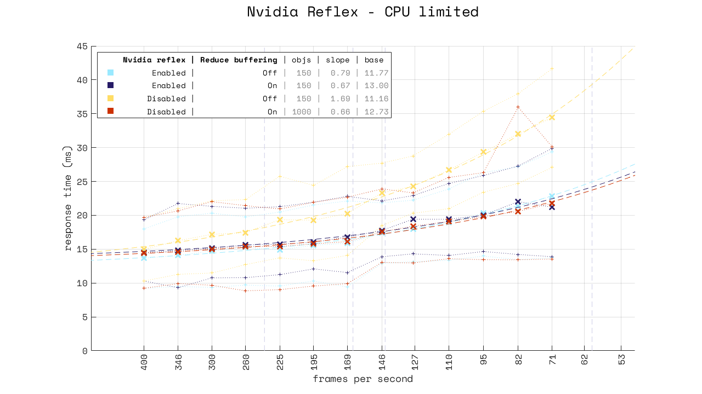
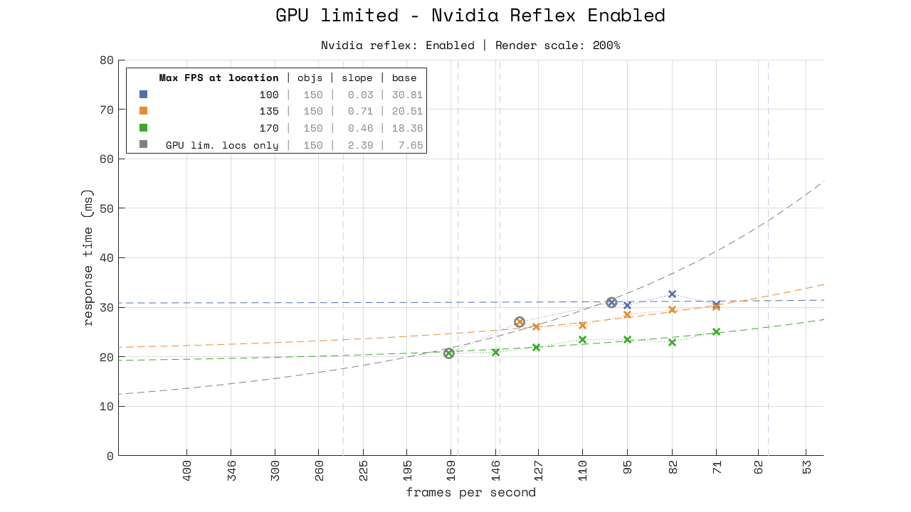

Nvidia reflex and low latency mode
==================================

Nvidia Reflex Low Latency mode aims to alleviate pipeline backpressure by "dynamically adapt[ing] the sleep time to ensure pipeline queuing depth is minimized and that application input is queried as late as possible". Here's a figure to explain:

Being CPU-bound - or forcing a CPU-bound with an in-game FPS limiter - both eliminate backpressure, and so will both dramatically reduce response time. The figure below shows the effect of capping to a selection of several framerates below the maximum (GPU-limited) framerate achievable at that in-game location.

*See the previous entry [Response time has variation](./01-variation.md) for more details on how to read the response time figures.*

What is immediately clear is that capping the framerate can substantially reduce response time, especially at lower framerates. The secondary effect is that [location matters](./01-variation.md#settings-matter) (link to previous entry), so the FPS-limited lower framerates don't have the same response time for the different locations.

Capping the framerate to below the worst-case lowest framerate (when uncapped) has until now been the best way to ensure a low response time. But finding a good compromise between as high a cap as possible (to make use of the hardware available) and low enough to never be backpressured (given that framerate tends to depend on *amount of stuff on screen*, which is not constant) is not trivial, and gaining an understanding that this is the correct thing to do is even less so.

Think of Nvidia Reflex as a "dynamic fps limiter" that caps the framerate to *exactly what the GPU can handle*. It's the best of both worlds - CPU work is delayed as long as possible to gather the freshest possible input data, but no later than what is needed to keep the GPU fed with data and generating as many frames as possible.

How? Well, unless they have solved the halting problem, knowing how long to delay the CPU work is based on an estimate of how long the previous n frames took to generate. But this is not mentioned explicitly in the documentation, although since `NvAPI_D3D_GetLatency` returns data from the previous 64 frames, "no more than 64" would seem to be a reasonable guess.

This also means that it should be possible to "trick" the sleep to wake up the CPU too early or too late, by "training" it on slow or fast frames respectively. This could then introduce some higher-response-time artifacts due to wrongly predicted execution time.

If you want to know more about how Nvidia Reflex actually works, the best source seems to be the pdf's in [the Reflex SDK](https://developer.nvidia.com/reflex), specifically `NVIDIA Reflex SDK DX Programming Guide.pdf`.

If you want to un-learn how Reflex works, read [marketing materials](https://www.nvidia.com/en-us/geforce/news/march-16-2021-game-ready-driver/), or [more marketing materials](https://www.nvidia.com/en-us/geforce/news/reflex-low-latency-platform/). (Reflex does not halve system latency. A baseline of 63 is about 3x as high as it should be, and anything can be made to look good when comparing to garbage. Measuring response time does not take $7000 in specialized equipment, it's about $35 including shipping.)

### Try it yourself

If you are here just for a recommendation on "optimal settings", you should instead try out the settings on your own to see what works best for you. Compare:

 - Scenario A: GPU-limited
   - Un-cap the in-game FPS limiter (set it to max)
   - Create a GPU-limited scenario by increasing your render scale or other graphics options until you get a frame rate as low as possible, but no lower than 75.
   - Check that you are GPU-limited with task manager, Afterburner, or `NvGpuUtilization.exe` (found in C:\Program Files\NVIDIA Corporation\Control Panel Client)
   - Take a mental note of the responsiveness of mouse movements and mouse clicks.
 - Scenario B: FPS-limited
   - Set the in-game FPS limiter to ~10 below your uncapped GPU-limted framerate from scenario A
   - Take a mental note of responsiveness.
 - Scenario C: Reflex
   - Un-cap the framerate (like Scenario A).
   - Enable Reflex.
   - Take a mental note of responsiveness.

Scenario A (GPU-limited) should feel noticeably laggy compared to scenario B (FPS-limited). Reflex is working as intended if scenario C feels the same as scenario B. Here's what it should look like if you were to plot it (assuming that Reflex works on your setup):

But first, something else
-------------------------

### Buffering

Before diving into Reflex, it's worth covering buffering too, specifically Overwatch's "Reduce Buffering" option. Although it would be reasonable to assume that nobody would ever enable a setting to "Increase Buffering", for some reason a substantial amount of the player base doesn't have reduce buffering enabled.

Enabling reduce buffering always produces lower response times. The difference is not exactly "one frame", but slightly less. There are also complex effects below tick rate (62.5 Hz / 16 ms) that are not shown or considered here (as noone who truly cares about game responsiveness play at frame rates below this, so it's a waste of time and effort on my end).

The question then is "why is reduce buffering?" Here's another figure to explain:

If you have a system that is unable to produce frames at a consistent rate, then increasing buffering will smoothen out the output rate. But adding buffering (via reduce buffering disabled, triple buffering, or pre-rendered frames) always increases latency, making it the option of absolute last resort. Fixing the source of uneven output rate is the real solution. For games, by far the easiest way to do this is to give the system "room to breathe" by capping the frame rate with the in-game FPS limiter.

### An oopsie with GSync

For all the tests shown in this document, GSync was enabled. This is unfortunate, because it introduces a discontinuity at 165 Hz (the display refresh rate), which means that:

 - It is only valid to compare trendlines (`slope` and `base`) if
   - they sample the same set of frame rates, OR
   - they only sample on one side of 165 Hz (either above or below)

But, the effect of GSync is:

 - uncorrelated to reduce buffering, Reflex, and anything else tested for this document
 - constant for each framerate (so comparing medians (`X` markers) for single framerates is ok)
 - small, compared to the effects of reduce buffering and Reflex

*So no, I am not re-measuring 141000 samples to fix this.*

See the default values of all settings in [`properties.json`](../assets/01-nvidia-reflex/properties.json)

CPU-limited
-----------

Since Nvidia Reflex is about eliminating backpressure from GPU-bound scenarios, it should have no effect when CPU-bound (via in-game FPS limiter)

And it doesn't. However, it does seem to include the outcome of Reduce Buffering without needing to enable it. In fact it might seem to be slightly better with reduce buffering off, but re-measuring this with 1000 samples per framerate show that there is no real difference:

*Why does reflex do this? Hypothesis: If the old engine sleep was entirely replaced with `NvAPI_D3D_Sleep` when Reflex is enabled, and the frame id numbering is consistent throughout the entire pipeline, then the new sleep will trigger at the (correct) later time, never allowing the buffer to be filled with anything at all, even if a buffer is present. Test: For a jank system that has high output rate variance from the CPU work, the combination of reduce buffering on + reflex enabled should remain jank and see no reduction of rate variance, unlike reduce buffering on + reflex disabled.*

Reflex also has a second option "Enabled + Boost". From the documentation: "Enabling Low Latency Boost may help to further reduce latency by retaining higher GPU clocks in CPU-bound performance scenarios where the clocks might otherwise drop in order to reduce power utilization."

I have my GPU overclocked, so there's no more to boost. Let's disable the overclock and see if it does something:

Still nothing.

*I think it's broken - I didn't see any clock boost in Afterburner. If you get a clock boost from it, it works for you. But if you know how to look for a clock boost, you also know how to overclock, which means it doesn't matter for you anyway.*

GPU-limited
-----------

Recall the GPU-limited scenario, and the effect of capping the frame rate:

With reflex, the GPU-limited maximum frame rate has the same response time as the capped framerates below it:

In other words: **Nvidia Reflex Low Latency Mode works**. Comparing in the same plot:

### Boost mode

There's still the question of "Enabled + Boost", let's compare, but with GPU clocks set to their default or automatic values:

Here, where Boost should have no effect, it has an effect. (I don't know why, please tell me if you do.)

Comparing Boost with a custom overclock, it is not exactly clear who the winner is.

### Variations with reduce buffering

Enabling Nvidia Reflex seems to negate the effect of "increase buffering" when CPU-limited, let's check that it still does this when GPU-limited:

For completeness, let's also compare the effect of reduce buffering when GPU-limited and Reflex enabled. It should have no effect, and it doesn't (note that this is "only" 150 samples per framerate, for 5100 samples in this image):

150 samples per frame rate is not enough to separate these two clearly enough, so here's a comparison of just GPU-limited locations with 1000 samples:

Again it is clear that reduce buffering has no effect when Reflex is enabled.

Tricking Reflex
---------------

There's no way to know how long it takes to execute a program without *actually executing it*, so in order to deliver the CPU work just-in-time to the GPU the best (or rather - *only*) way to do this is by predicting how long it takes to execute that work. It is always possible that this prediction is wrong. The most common kind of mis-prediction is going to be *slower than predicted*, given that the CPU is shared with Windows and every other running application.

There are two questions here:

 1. Does an execution time mis-predict have an effect on response time?
 2. How frequently does a mis-predict occur?

The expected answer to **2.** is *rarely, in increasing rarity with higher framerates*. This is because two consecutive frames are going to have very similar execution times, because they contain almost exactly the same contents. The higher the framerate the more similar the contents, because the relative amount of motion (from both the player and other entities) goes down. This means the only way to provoke a mis-predict is with a 180 HyperFlick of literally inhuman speed (or if you are a player using a sensitivity of about 5 mm per 360 with a 125 Hz mouse).

The hypothesis for **1.**:

  - Trained on slow frames (low framerate), flicking to fast frame:
   CPU work will be started "too early", and data will grow stale before it is sent to the GPU. GPU will generate a fast frame as normal.
   Prediction: Response time somewhere between all-fast and all-slow scenarios.
 - Trained on fast frames (high framerate), flick to slow frame:
   CPU work will be started "too late", and GPU has to wait. Even though inputs are gathered later, the GPU wait will be larger. GPU will generate a slow frame as normal.
   Prediction: Response time will be higher than the all-slow scenario.

In the test below `a->b` means "trained on fps a -> flicked to fps b" (where those fps are found with 200% render scale - the test is done with 100%):

Almost exactly as predicted, the only missing thing is that the effect diminishes with lower framerates. The reason: The *relative* amount of work per frame-interval decreases as the frame-interval increases (we have longer pauses between frames). Let's say it took 5 ms for a slow frame and 3 ms for a fast frame. We then force a mis-prediction (either 2 ms too early or 2 ms too late). At 250 fps, that's half a frame mis-prediction. At 70 fps, that's a bit less than one-seventh of a frame. The "timing window" that the prediction has to hit gets larger the more slack (sleep from the FPS-limiter) we give it.

Low latency mode
----------------

Before Reflex, an option for "Low Latency Mode" was introduced in the Nvidia control panel. This setting seems to manage the buffer between CPU and GPU, though that is also what the pre-rendered frames setting does... It's very much *not clear*, and my suspicion is that this is just marketing bullshit to counter AMD's "anti-lag" marketing bullshit. I mean, who doesn't want "Ultra Low Latency"? And who doesn't want "anti-lag"?

Obviously, a game engine with competent programmers behind it will not pre-render frames, so as expected this setting does nothing at all. If for whatever reason you want to force pre-rendered frames, the option is now called "Virtual Reality pre-rendered frames", for - presumably - marketing reasons.

Conclusions
-----------

 - Nvidia Reflex works - the effects of backpressure from the GPU are entirely eliminated.
 - Reflex Boost mode seems to do nothing, try it and watch your clocks.
 - The Reduce Buffering option seems to no longer be necessary.
 - Never trust marketing materials.

